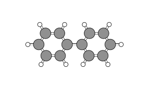
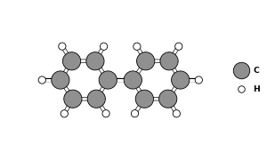
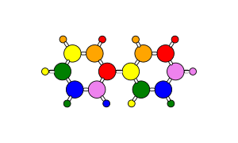
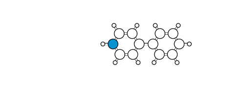
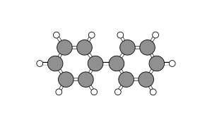
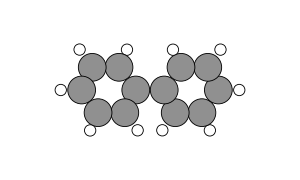
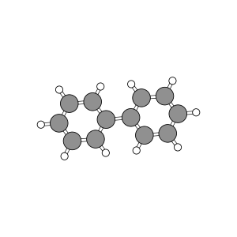
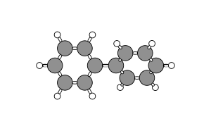
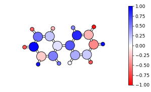

# molgif

create smooth gifs of rotating molecules

## Examples

### Use smart_rotate to find the best viewing angle

    import molgif
    import ase.build

    # load in molecule (ase.Atoms object)
    molecule = ase.build.molecule('biphenyl')

    # create rotating gif with rot_gif function
    molgif.rot_gif(molecule, smart_rotate=True)

### Add a legend

    molgif.rot_gif(molecule, add_legend=True)

### Specify the color of each atom

    # can be a string for one color or a list of custom colors
    rainbow = ['red', 'orange', 'yellow',
               'green', 'blue', 'violet'] * 4

    # list much match number of atoms
    rainbow = rainbow[:len(molecule)]

    molgif.rot_gif(molecule, colors=rainbow)

### Use a dictionary to quickly color by atom type

    # default colors will be used for types not specified
    molgif.rot_gif(molecule, colors=dict(C='hotpink'),
                   add_legend=True)

### Anchor an atom to be at the center of rotation

    # define index of atom to anchor
    anchor = 3

    colors = ['white'] * len(molecule)
    colors[anchor] = '#0892d0'

    molgif.rot_gif(molecule, colors=colors,
                   anchor=anchor)

### Adjust loop time and FPS

    # loop_time = time to complete one rotation (seconds)
    molgif.rot_gif(molecule, loop_time=2, fps=60)

### Turn off bonds and scale atomic sizes

    molgif.rot_gif(molecule, add_bonds=False,
                   scale=0.9)

### Change rotation axis

    # switch between x, y (Default), or z
    molgif.rot_gif(molecule, rot_axis='z')

### Switch rotation direction

    # counterclockwise (ccw)[Default] or clockwise (cw)
    # based on rot_axis
    # 'x': view from left
    # 'y': view from top
    # 'z': view into screen
    molgif.rot_gif(molecule, direction='cw')

### Visualize charges

    import random

    # random charges [-1, 1]
    chgs = [-1 + 2 * random.random() for i in molecule]

    # manually set the colorbar range (optional)
    cb_range = (-1, 1)

    molecule.set_initial_charges(chgs)

    molgif.rot_gif(molecule, use_charges=True,
                   cb_range=cb_range)

## Requirements

- ase
- matplotlib
- ImageMagick (command line tools must be installed)
