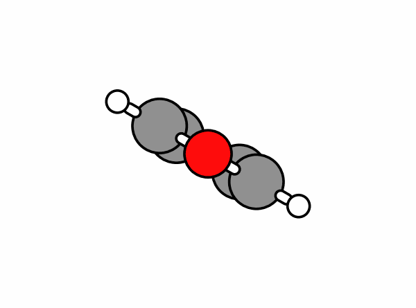
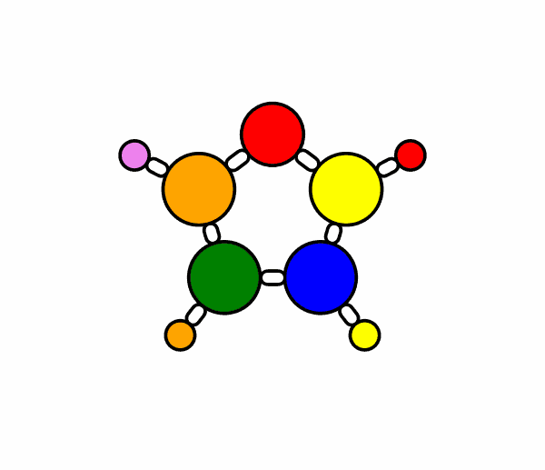
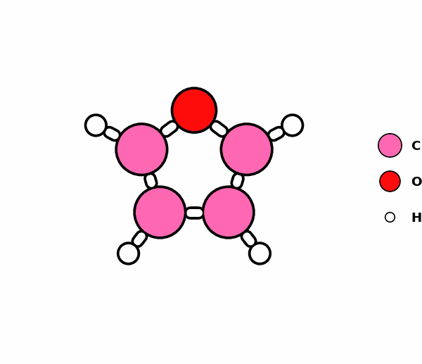
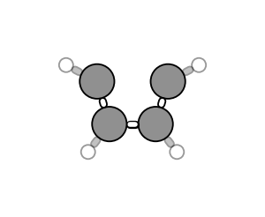
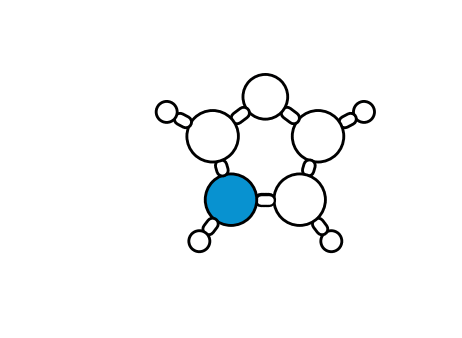
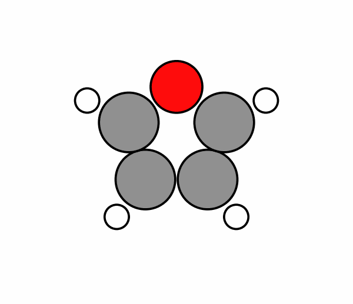
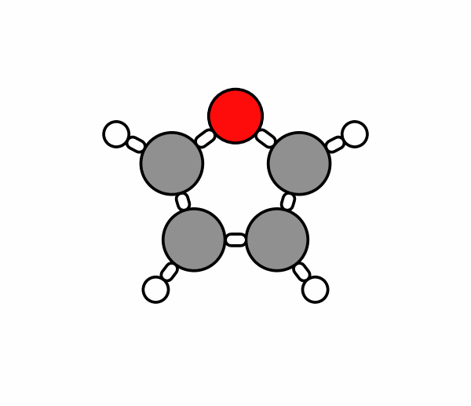
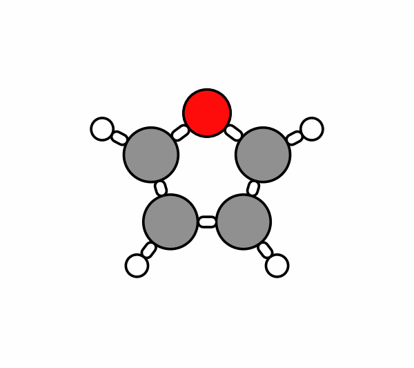
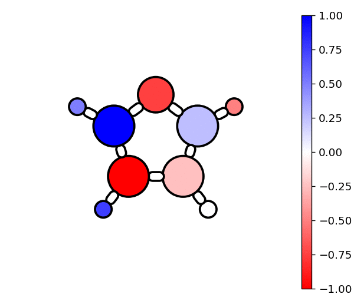

# molgif

create smooth gifs of rotating molecules


## Installation

```console
root@host:~$ pip install molgif
```

## Easily create visuals in 3 different ways

- **Functional**

    ```python
    molgif.rot_gif
    ```

- **Object-oriented**

    ```python
    molgif.Molecule
    ```

- **Command Line**

    ```console
    root@host:~$ molgif --help
    ```

## Examples

### Easily create gifs of rotating molecules

Can take geometry file (e.g. *"c4h4o.xyz"*) or ase.Atoms object

```python
import molgif
import ase.build

# load in molecule (ase.Atoms object)
# can also use geometry file path!
c4h4o = ase.build.molecule('c4h4o')
c4h4o.rotate(60, 'z')
```

- **Functional**

    ```python
    molgif.rot_gif(c4h4o)
    ```

- **Object-oriented**

    ```python
    mol = molgif.Molecule(c4h4o)
    mol.save_rot_gif()
    ```

- **Command Line**

    ```console
    root@host:~$ molgif c4h4o.xyz
    ```



### Use smart_rotate to find best viewing angle and add a legend

- **Functional**

    ```python
    molgif.rot_gif(c4h4o, smart_rotate=True, add_legend=True)

    # can also smart_rotate ase.Atoms object using function in utils
    c4h4o = molgif.utils.smart_rotate_atoms(c4h4o)
    ```

- **Object-oriented**

    ```python
    mol = molgif.Molecule(c4h4o)
    mol.smart_rotate()
    mol.draw_legend()
    mol.save_rot_gif()
    ```

- **Command Line**

    ```console
    root@host:~$ molgif c4h4o.xyz --smart-rotate --legend
    ```


### Specify the color of each atom

```python
# can be a string of a single color
colors = 'blue'

# or a list of custom colors
# (list length much match number of atoms)
rainbow = ['red', 'orange', 'yellow',
           'green', 'blue', 'violet',
           'red', 'orange', 'yellow']

colors = rainbow
```

- **Functional**

    ```python
    molgif.rot_gif(c4h4o, colors=colors)
    ```

- **Object-oriented**

    ```python
    mol = molgif.Molecule(c4h4o)
    mol.colors = colors
    mol.save_rot_gif()
    ```

- **Command Line**

    Specify single color

    ```console
    root@host:~$ molgif c4h4o.xyz --colors yellow
    ```

    Separate multiple colors using "-" (length must match # atoms)

    ```console
    root@host:~$ molgif c4h4o.xyz --colors r-orange-yellow-g-b-violet-r-orange-yellow
    ```



### Use a dictionary to quickly color by atom type and add a legend

Default colors will be used for types not specified

- **Functional**

    ```python
    molgif.rot_gif(c4h4o, colors={'C': 'hotpink', 'O': 'dodgerblue'},
                   add_legend=True)
    ```

- **Object-oriented**

    ```python
    mol = molgif.Molecule(c4h4o)
    mol.colors = {'C': 'hotpink', 'O': 'dodgerblue'}
    mol.draw_legend()
    mol.save_rot_gif()
    ```

- **Command Line**

    Color dict can be defined as *(symbol-color)-* pairs

    ```console
    root@host:~$ molgif c4h4o.xyz --colors C-hotpink-O-dodgerblue --legend
    ```



### Hide atoms and set alpha values

Hide based on atom type or index
Alpha (transparency) values: 0 = invisible, 1 = opaque
Bonds: alpha value set to minimum alpha between atoms

- **Functional**

    ```python
    molgif.rot_gif(c4h4o, hide=['O'], alphas={'H': 0.4})
    ```

- **Object-oriented**

    ```python
    rem_h = c4h4o[c4h4o.symbols != 'O']
    mol = molgif.Molecule(rem_h)
    mol.alphas = {'H': 0.4}
    mol.save_rot_gif()
    ```

- **Command Line**

    ```console
    root@host:~$ molgif c4h4o.xyz --hide O --alphas H-0.4
    ```



### Anchor an atom to be at the center of rotation

Can define:

- atom index (based on order of atoms)
- atomic symbol (first matching atom type selected based on order)
- "center" (selects closest atom to center of molecule)

```python
# define index of atom to anchor
anchor = 3

colors = ['white'] * len(c4h4o)
colors[anchor] = '#0892d0'
```

- **Functional**

    ```python
    molgif.rot_gif(c4h4o, colors=colors,
                   anchor=anchor)
    ```

- **Object-oriented**

    ```python
    mol = molgif.Molecule(c4h4o)
    mol.colors = colors
    mol.anchor(anchor)
    mol.save_rot_gif()
    ```

- **Command Line**

    ```console
    root@host:~$ molgif c4h4o.xyz --anchor 3 --colors 3-#0892d0
    ```



### Adjust loop time and FPS

loop_time = time to complete one rotation (seconds)

- **Functional**

    ```python
    molgif.rot_gif(c4h4o, loop_time=2, fps=60)
    ```

- **Object-oriented**

    ```python
    mol = molgif.Molecule(c4h4o)
    mol.save_rot_gif(loop_time=2, fps=60)
    ```

- **Command Line**

    ```console
    root@host:~$ molgif c4h4o.xyz --loop-time 2 --fps 60
    ```



### Turn off bonds and scale atomic sizes

- **Functional**

    ```python
    molgif.rot_gif(c4h4o, add_bonds=False,
                   scale=0.9)
    ```

- **Object-oriented**

    ```python
    mol = molgif.Molecule(c4h4o)
    mol.remove_bonds()
    mol.scale = 0.9
    mol.save_rot_gif()
    ```

- **Command Line**

    ```console
    root@host:~$ molgif c4h4o.xyz --no-bonds --scale 0.9
    ```



### Change rotation axis

- x: top-to-bottom
- **y**: left-to-right (**Default**)
- z: counterclockwise

Examples changing to 'x':

- **Functional**

    ```python
    molgif.rot_gif(c4h4o, rot_axis='x')
    ```

- **Object-oriented**

    ```python
    mol = molgif.Molecule(c4h4o)
    mol.rot_axis = 'x'
    mol.save_rot_gif()
    ```

- **Command Line**

    ```console
    root@host:~$ molgif c4h4o.xyz --rot-axis x
    ```



### Switch rotation direction

negative rot_axis (e.g. "-x") reverses direction

- **Functional**

    ```python
    molgif.rot_gif(c4h4o, rot_axis='-x')
    ```

- **Object-oriented**

    ```python
    mol = molgif.Molecule(c4h4o)
    mol.rot_axis = '-x'
    mol.save_rot_gif()
    ```

- **Command Line**

    ```console
    root@host:~$ molgif c4h4o.xyz --rot-axis -x
    ```


### Visualize charges

```python
# random charges [-1, 1]
chgs = np.linspace(-1, 1, len(atoms))
np.random.shuffle(chgs)

# add the charges to atoms object
atoms.set_initial_charges(chgs)

# also works with xyz files if saved from an
# ase.Atoms object with inital_charges defined
atoms.write('c4h4o.xyz')
```

- **Functional**

    Use charges automatically centers cmap around 0

    ```python
    molgif.rot_gif(atoms, max_px=max_px, use_charges=True)
    ```

- **Object-oriented**

    Colors can be defined as values, which uses a cmap to specify atom colors

    ```python
    mol = molgif.Molecule(c4h4o)

    # manually center cmap around 0
    mol.center_data = True

    mol.colors = mol.atoms.get_initial_charges()
    mol.save_rot_gif()
    ```

- **Command Line**

    Assumes that initial_charges are defined in xyz file (using ase)

    ```console
    root@host:~$ molgif c4h4o.xyz --use-charges
    ```



## Requirements

- ase
- matplotlib
- click
- pillow
- ImageMagick (command line tools must be installed)
